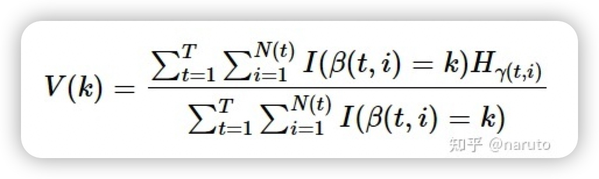
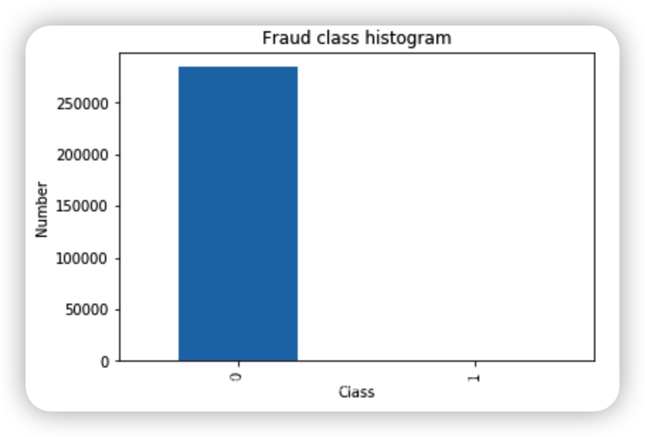

# 回答整理
## XGBoost算法
### 特征重要度
#### 1. 内置的特征重要性计算方式
xgboost有5中内置的特征重要性计算方式，分别是'weight', 'gain', 'cover', 'total_gain', 'total_cover'
具体含义如下所示：
>

这里对前面三个计算方式详细说明，weight,gain,cover.
##### 1.1 weight
特征在所有树中作为划分属性的次数。
##### 1.2 gain
特征在作为划分属性时loss平均的降低量(也就是特征的信息增益)，以特征k=1,2,...,K为例，其重要度计算可以表述如下：
```math
V(k) = \dfrac{1}{2}\dfrac{\Sigma_{t=1}^{T}\Sigma_{i=1}^{N(t)}I(\beta(t,i)=k)(\dfrac{G_{r(t,i,L)}^2}{H_{r(t,i,L)}+\gamma}+\dfrac{G_{r(t,i,R)}^2}{H_{r(t,i,R)}+\gamma}-\dfrac{G_{r(t,i)}^2}{H_{r(t,i)}+\gamma})}{\Sigma^T_{t=1}\Sigma_{i=1}^{N(t)}I(\beta(t,i)=k)}
```
* 这里k表示某节点，T表示所有树的数量，$N(t)$ 表示第t棵树的非叶子节点数量，$\beta(t,i)$表示第t棵树的第i个非叶子节点的划分特征，所以$B(.)\in1,2,3,...,K$， $I(.)$是指示函数， $G_r(t,i)$， $H_r(t,i)$分别表示落在第t棵树上第i个非叶子节点上所有样本的一阶导数和二阶导数之和，$G_r(t,i,L)$， $G_r(t,i,R)$分别表示落在第t棵树上第i个非叶子节点的左、右节点上的一阶导数之和，同理，$H_r(t,i,L)$， $H_r(t,i,R)$分别表示落在第t棵树上第i个非叶子节点的左、右节点上的二阶导数之和，所以有
```math
G_r(t,i) = G_r(t,i,L)+G_r(t,i,R)
```
```math
H_r(t,i) = H_r(t,i,L)+H_r(t,i,R)
```
##### 1.3 cover
* 这个计算方法，需要在定义模型时定义。之后再调用model.feature_importance_得到的便是cover得到的贡献度。
* cover形象地说，就是树模型在分裂时，特征下的叶子节点涵盖的样本数除以特征用来分裂的次数。分裂越靠近根部，cover值越大。比如可以定义为：特征在作为划分属性时对应样本的二阶导数之和的平均值：
 


### 附录
* [xgboost与gbdt的区别](https://zhuanlan.zhihu.com/p/138717024)
* [为什么xgboost要使用泰勒二阶展开](https://zhuanlan.zhihu.com/p/453243471)
* [为什么决策树的损失函数是交叉熵](https://zhuanlan.zhihu.com/p/446732237)
* [xgboost特征重要性计算方式](https://zhuanlan.zhihu.com/p/513336850)
## DBSCAN算法
## Fraudar算法
## LR算法
### 线性回归
### 逻辑回归
## 频繁模式(frequent pattern)
## 采样
### 下采样
#### 什么是下采样
当原始数据的分类极不均衡时，如下图


> 我们要想用这样的数据去建模显然是存在问题的。尤其是在我们更关心少数类的问题的时候数据分类不均衡会更加的突出，例如，信用卡诈骗、病例分析等。在这样的数据分布的情况下，运用机器学习算法的预测模型可能会无法做出准确的预测，最后的模型显然是趋向于预测多数集的，少数集可能会被当做噪点或被忽视，相比多数集，少数集被错分的可能性很大。从本质上讲，机器学习算法就是从大量的数据集中通过计算得到某些经验，进而判定某些数据的正常与否。但是，不均衡数据集，显然少数类的数量太少，模型会更倾向于多数集。
## LR算法原理
### Q：逻辑斯特回归为什么要对特征进行离散化？
> 什么时候要对特征进行离散化？
* 有些特征虽然也是数值型的，但是该特征的取值相加相减是没有实际意义的，如年龄，那么该数值型特征也要看成离散特征，采用离散化的技术。
* 特征的连续值在不同的区间的重要性是不一样的，所以希望连续特征在不同的区间有不同的权重，实现的方法就是对特征进行划分区间，每个区间为一个新的特征。常用做法，就是先对特征进行排序，然后再按照等频离散化为N个区间。
1. 非线性。逻辑回归属于广义线性模型（只是通过sigmoid函数将预测范围转换为0-1），表达能力受限；单变量离散化为N个后，每个变量有独特的权重，相当于为模型引入了非线性，能够提升模型的表达能力，加大拟合。离散特征的增加和减少都很容易，易于模型的快速迭代。
2. 速度快。稀疏向量内积乘法运算速度快，计算结果方便存储，容易扩展。
3. 鲁棒性。离散化后的特征对异常数据有很强的鲁棒性：比如一个特征是年龄>30是1，否则是0。如果特征没有离散化，一个异常数据 ‘ 年龄300 ’ 会给模型造成很大的干扰。
4. 方便交叉与特征组合。离散化后可以进行特征交叉，由 M + N 个变量变为 MN个变量（比如20-30年龄段，身高170-180之间的组合成一个特征），进一步引入非线性，提升表达能力。
5. 稳定性。特征离散化后，模型会变得更稳定，比如如果对用户年龄离散化，20-30作为一个区间，不会因为一个用户年龄长了一岁，就变成一个完全不同的人，当然处于区间相邻的样本会刚好相反，所以怎么划分区间是门学问。
6.简化模型。特征离散化后，起到了简化了逻辑回归模型的作用，降低了模型过拟合的风险。
## 特征稳定性
## 特征工程
## 特征筛选
* [如何浅显得理解风控模型中的特征筛选|附实操细节(全)](https://blog.csdn.net/weixin_45545159/article/details/123719196)
* [为什么在使用xgboost的时候要对特征按重要性筛选？](https://www.zhihu.com/question/265195225)
## 过拟合和欠拟合
### 怎么判断过拟合和欠拟合？
### 有哪些原因会导致过拟合？
> 数据层面
* 训练集和测试集的数据分布不一致
* 训练数据集太少，样本单一，模型无法从中学到泛化的规则
* 训练集中的噪音太多，导致模型过分记住了噪音特征
> 模型层面
* 模型过于复杂，换句话说就是模型把这些数据“死记硬背”了下来，而不是学到了泛化规则。
#### 过拟合如何解决？
> 数据层面
* 增加数据的量，或者增加数据的多样性，让模型学到更有效的特征。
> 模型层面
* 降低模型的复杂度，把模型变得更简单。如决策树的剪枝算法、神经网络中的L2/L1正则化等。
> 训练层面
* 使用验证集，当验证集发生过拟合现象时及早停止模型。
* 在训练过程中使用正则化技术，如神经网络中的Dropout、L2、L1正则化等。
> 模型融合
* 把多个模型集成在一起，降低模型过拟合的风险，如Bagging方法。
### 有哪些原因会导致欠拟合？
* 欠拟合一般是模型表达能力不够或者说数据有问题，导致无法从数据中学到有效的特征与规则。
> 数据层面
* 数据特征表达能力不强或者现有特征与标签之间的相关性不强。
> 模型层面
* 假设的模型太简单，导致无论怎么学习都无法学到有效的信息，即模型“先天不足”。
* 模型合适，但是没有训练好，即模型还没有训练到收敛的情况。
#### 解决欠拟合的常见方法有哪些？
* 添加新的数据特征
* 增加模型复杂度，假设一个更复杂的空间
* 减小正则化系数
* 增加模型训练时间，直到模型收敛为止
### Q: 降维能不能解决过拟合？
* 降维只是减少了特征的维度，并没有减小特征的所有信息，故降维不能解决过拟合，减少特征个数可以解决过拟合。
## 特征稳定性
* [特征稳定性指标（CSI）](https://zhuanlan.zhihu.com/p/433245521)
* 