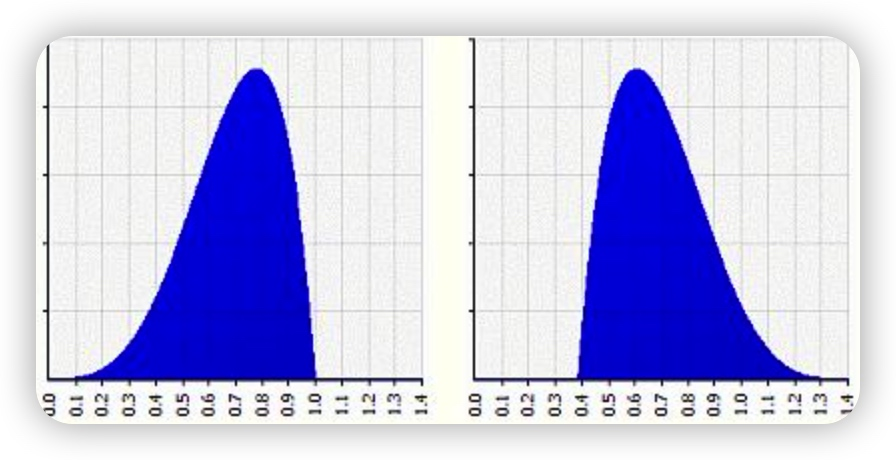
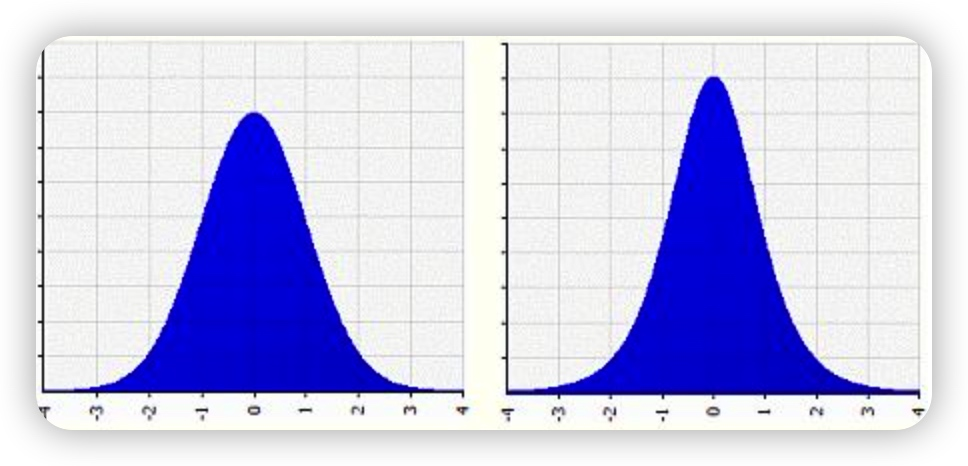
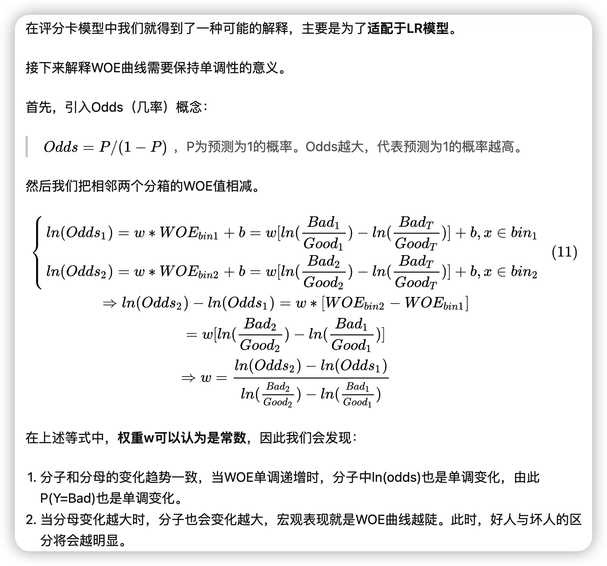
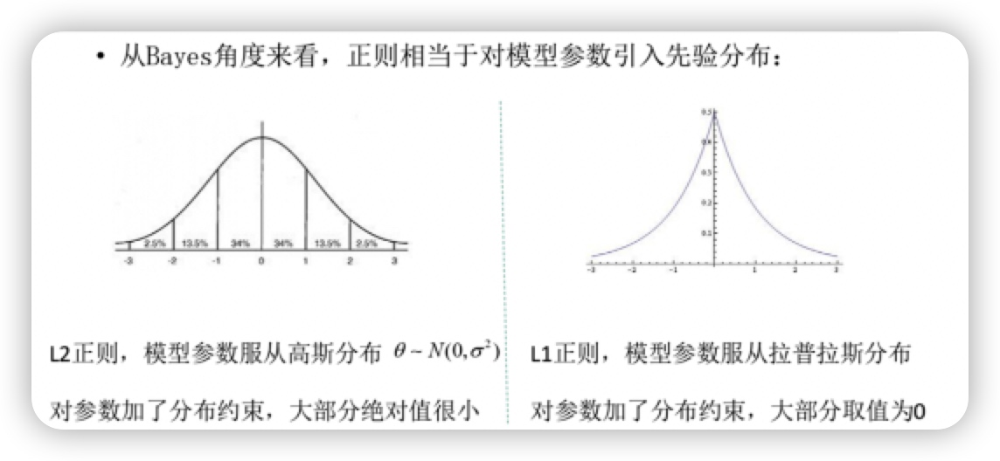
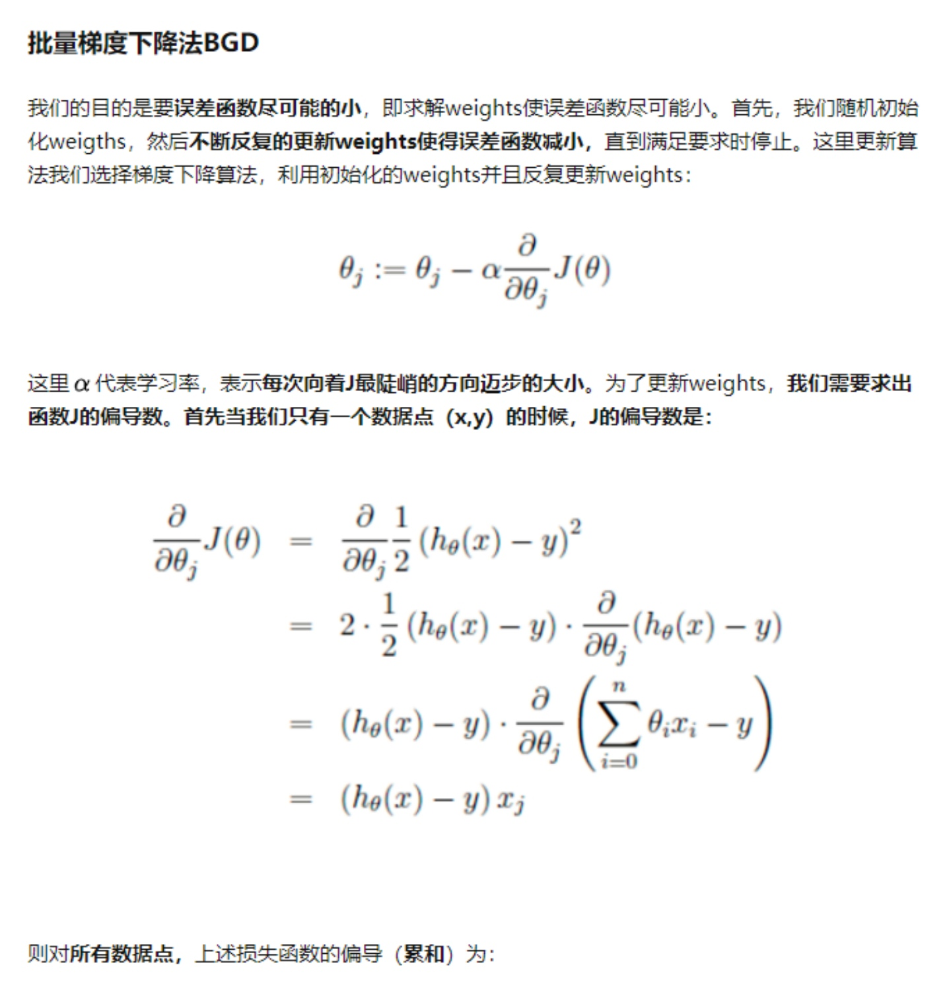
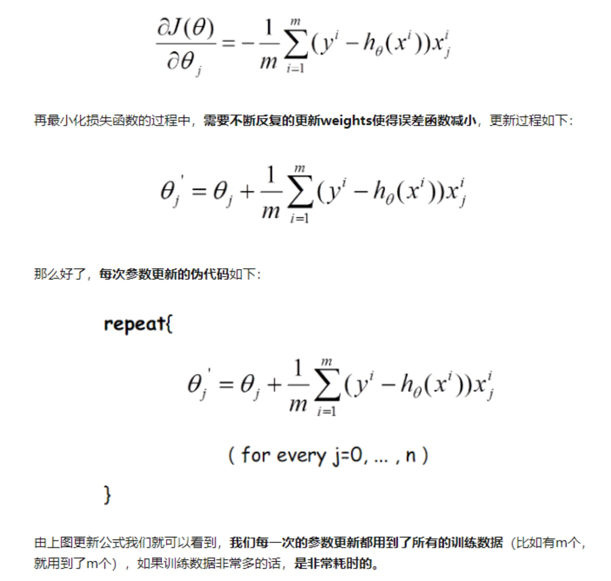
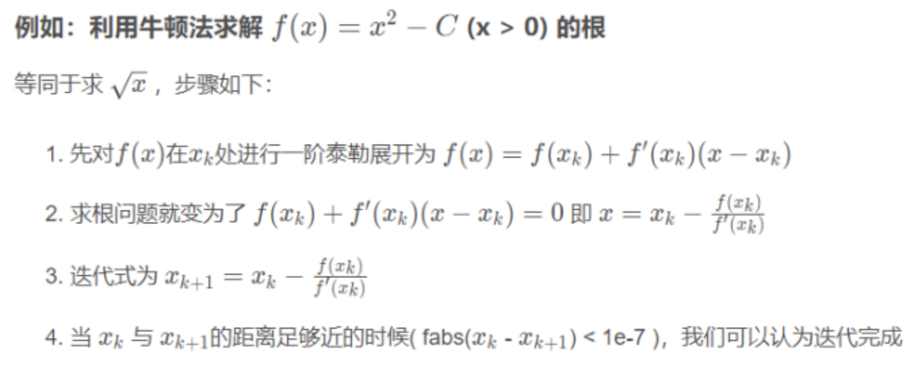

# 机器学习知识整理
## 1.EDA（Exploratory Data Analysis，探索性数据分析）
### 偏度与峰度
我们一般会拿偏度和峰度来看数据的分布形态，而且一般会跟正态分布做比较，我们把正态分布的偏度和峰度都看做零。如果我们在实操中，算到偏度峰度不为0，即表明变量存在左偏右偏，或者是高顶平顶这么一说。

#### 偏度
是描述数据分布形态的统计量，其描述的是某总体取值分布的**对称性**，简单来说就是数据的不对称程度。偏度是**三阶中心距**计算出来的
计算公式：
```math
skew(X)=E[(\dfrac{X-\mu}{\sigma})^3]
```
* Skewness = 0，分布形态与正态分布偏度相同
* Skewness > 0，正偏差数值较大，为正偏或右偏，长尾巴拖在右边，数据右边有较多的极端值
* Skewness < 0，负偏差数值较大，为负偏或左偏，长尾巴拖在左边，数据左边有较多的极端值
* 数值的绝对值越大，表明数据分布越不对称，偏斜程度大


例如上图中，两个概率分布图都是均值=0.6923，标准差=0.1685的，但是他们的形状是不一样的，左图偏度=-0.537，形状左偏，右图偏度=0.537，形状右偏。
#### 峰度
是描述某变量取值分布形态陡缓程度的统计量，简单来说就是数据分布项的**尖锐程度**。峰度是**四阶标准距**计算出来的
计算公式：
```math
Kurt[X] = E[(\dfrac{X-\mu}{\sigma})^4]
```
* Kurtosis = 0 与正态分布的陡缓程度相同
* Kurtosis > 0 比正态分布的高峰更加陡峭——尖顶峰
* Kurtosis < 0 比正态分布的高峰来得平坦——平顶峰


例如上图中，左图是标准正太分布，峰度=3，右图的峰度=4，可以看到右图比左图更高尖。
## 2.预处理
### 对数变换
我们在数据预处理过程中经常见到对于有偏数据进行log变换，变换后的数据能更加接近正态分布。关于有偏数据的判定，一般是计算偏度值skewness。
### Q:为什么有偏数据经过对数变换后会更加接近正态分布呢?，[在统计学中为什么要对变量取对数？](https://www.zhihu.com/question/22012482/answer/21315349)
* 原因在于对数最基本的运算法则：
```math
log_e(A)-log_e(B) = log_e(A/B)
```
### 分箱
#### 无监督分箱
#### 有监督分箱
    包括 Split 分箱和 Merge 分箱
    Chimerge分箱
todo
### 量纲统一
* 标准化：特征均值为0，方差为1。
```math
\dfrac{x-np.mean(x)}{np.std(x)}
```
* 归一化：把每个特征向量的值都缩放到相同的数值范围，如[0,1]，[-1,1]。最常用的归一化形式就是将特征向量调整为L1范数，使特征向量的数值之和为1。而L2范数就是欧几里得之和。
```math
\dfrac{x-Min(x)}{Max(x)-Min(x)}
```
* 目的：归一化和标准化的目的是为了计算更方便
    > 比如两变量的量纲可能不同，可能一个的值远大于另一个，那么他们同时作为变量的时候，可能会造成数值计算问题，比如说求矩阵的逆可能很不精确，或者梯度下降的收敛比较困难，还有如果需要计算欧氏距离的话，可能量纲也需要调整，所以 lr 和 knn 的标准化一下应该有好处。其他的算法，也同理。
### Q: 哪些机器学习算法不需要做归一化处理？
* 在实际应用中，通过梯度下降法求解的模型一般都是需要归一化的，比如线性回归，logistic回归，SVM，神经网络等模型。但是树形模型不需要做归一化，因为它们之间不关心变量的值，而是关心变量的分布，只是基于排序的划分，而是关心变量的分布和变量之间的条件概率，如决策树，随机森林。
* 目前认知：构建随机森林、GBDT、XGB寻找最优点时是通过寻找最优分裂点完成的，因此树模型是阶跃的，阶跃点是不可导的，并且求导没意义，也就不需要归一化。gbdt的梯度下降感觉是函数空间下的梯度下降，跟普通的梯度下降还是不一样的，核心还是每一轮在拟合负梯度数据而非直接对参数做梯度下降
## 3.IV值计算（特征筛选）
### 定义
IV（Infomation Value），信息价值，用来表示特征对目标预测的贡献程度，即特征的预测能力，一般来说，IV值越高，该特征预测能力越强，信息贡献度越高。
### 限定条件
IV值的计算有一定的限定条件：
* 面向的任务必须是有监督的任务
* 预测目标必须是二分类
### IV取值区间及常用评价标准
* IV的取值范围为[0，+∞）
* IV值的取值含义：
    * IV < 0.02：无用特征
    * 0.02 < IV < 0.1：弱价值特征
    * 0.1 < IV < 0.3：中价值特征
    * 0.3 < IV < 0.5：强价值特征
    * 0.5 < IV：价值过高，不真实
### 计算方式
IV值计算依赖于WOE值，所以在计算IV值前得先计算WOE值
#### WOE值
* WOE定义：Weight Of Evidence，证据权重，表示描述一个可预测的变量与二分类变量之间的关系
* 在使用WOE之前，需要对变量进行分箱处理
* 计算公式：
```math
WOE_i = ln(\dfrac{Bad_i}{Bad_T}/\dfrac{Good_i}{Good_T})=ln(\dfrac{Bad_i}{Bad_T})-ln(\dfrac{Good_i}{Good_T})
```
* WOE也可以理解为当前分箱中坏客户和好客户的比值，和所有样本中这个比值的差异 (也就是我们随机的坏客户和好客户的比例)。即：
```math
WOE_i = ln(\dfrac{Bad_i/Good_i}{Bad_T/Good_T})
```
* WOE越大，这种差异越大，当前分组里的坏客户的可能性就越大，WOE越小，差异越小，这个分组里的样本响应的可能性就越小。当分箱中坏客户和好客户的比例等于随机坏客户和好客户的比值时，说明这个分箱没有预测能力，即WOE=0。
#### IV值
* 计算公式：
```math
IV_i = (\dfrac{Bad_i}{Bad_T}-\dfrac{Good_i}{Good_T})*WOE_i
```
```math
IV_i = (\dfrac{Bad_i}{Bad_T}-\dfrac{Good_i}{Good_T})*ln(\dfrac{Bad_i}{Bad_T}/\dfrac{Good_i}{Good_T})
```
* 在建模过程中，IV值主要用于特征选择，如果想要对变量的预测能力进行排序的话，可以按 IV 值从高到低筛选即可。
### Q: WOE 和 IV 都能表达某个分组对目标变量的预测能力。但实际中，我们通常选择 IV 而不是 WOE 的和来衡量变量预测的能力，这是为什么呢？
* 首先，因为我们在衡量一个变量的预测能力时，我们所使用的指标值不应该是负数。从这意义上来说，IV 比 WOE 多乘以前面那个因子，就保证了它不会是负数（(a-b)*(lna-lnb)始终为正值）
* 然后，乘以这个因子，体现出了变量当前分组中个体的数量占整体的比例，从而很好考虑了这个分组中样本占整体的比例，比例越低，这个分组对变量整体预测能力的贡献越低，即对WOE值的加权和。相反，如果直接用 WOE 的绝对值加和，会因为该分组出现次数偏少的影响而得到一个很高的指标。对于变量的一个分组，这个分组的坏人占整体坏人占比和好人占整体好人占比的比例相差越大，即WOE的绝对值越大，IV值越大，否则，IV值越小；极端情况下，当前分组的坏人占整体坏人占比和好人占整体好人占比的比例相等时即WOE=0时，IV值为0；IV值的取值范围是[0,+∞)，且当前分组中只包含坏人或者好人时，IV = +∞(因为(a-b)*ln(a/b)，ln0为-∞，ln+∞为+∞)。所有好人坏人均在一个分箱时，IV=0。IV值会随着分箱数的变多而增长，但是如果分箱数量过多，比如大于20个分箱会导致每个分箱中样本数量太少，导致某个分箱几乎没有好人或者是几乎没有坏人。
### Q: WOE保持单调性
* 

### 附录
* [使用决策树分箱](https://blog.csdn.net/MarkAustralia/article/details/114873479)
## 4.L1范式和L2范式的区别
* L1范式是对应参数向量绝对值之和
* L1范式具有稀疏性
* L1范式可以用来防止过拟合，也可以作为特征选择，并且可解释性较强
* L2范式是对应参数向量的平方和，再求平方根
* L2范式是为了防止机器学习过拟合，提高模型的泛化能力
* 
### Q：L1范式为什么可以用作特征选择
* 因为L1正则化公式具有不完全可微性，对w的导数在0处会有突变，易出现极小值点，因此易优化到w=0处，所以求出的w解具有稀疏性，可以用作特征选择
### [L1、L2范式均可以防止过拟合原理](https://blog.csdn.net/Sakura55/java/article/details/80977090)
* 拟合过程中通常都倾向于让权值尽可能小，最后构造一个所有参数都比较小的模型。因为一般认为参数值小的模型比较简单，能适应不同的数据集，也在一定程度上避免了过拟合现象。可以设想一下对于一个线性回归方程，若参数很大，那么只要数据偏移一点点，就会对结果造成很大的影响；但如果参数足够小，数据偏移得多一点也不会对结果造成什么影响，专业一点的说法是『抗扰动能力强』。
### 总结
* L1正则能产生等于0的权值，即能够剔除某些特征在模型中的作用（特征选择），即产生稀疏的效果。
* L2正则可以得迅速得到比较小的权值，但是难以收敛到0，所以产生的不是稀疏而是平滑的效果
## 5.优化算法及其优缺点
> 随机梯度下降
* 优点：训练速度快，可以一定程度上解决局部最优解的问题
* 缺点：SGD并不是每次迭代都向着整体最优化方向，收敛速度较慢，因为由于随机梯度下降法一次迭代一个样本，导致迭代方向变化很大，不能很快的收敛到局部最优解。
> 批量梯度下降
* 优点：收敛速度较快，迭代次数少。
* 缺点：训练速度慢，容易陷入局部最优解
* 

> mini_batch梯度下降
* 综合随即梯度下降和批量梯度下降的优缺点，提取的一个中和的方法。
> 牛顿法
1. 求解原函数的零点问题（方程的根）：
```math
x_{n+1} = x_n - f(x_n)/f'(x_n)    
```

 2. 最优化问题,求解原函数的最值问题，转换为求一阶导数的零点问题
 ```math
 x^{(k+1)} = x^{(k)} - H^{-1}_kg_k
 ```
 g为一阶偏导，H为二阶偏导
 

### 牛顿法与梯度下降法的区别：
* 牛顿法将损失函数二阶泰勒展开求极值点，求极值点的方式是利用切线法求解一阶导数的零点。而梯度下降是利用一阶负梯度方向逼近极值点。
> 拟牛顿法
* 拟牛顿法是为了改进牛顿法在迭代过程中，计算Hessian矩阵而提取的算法，牛顿法在迭代的时候，需要计算Hessian矩阵，当维度较高的时候，计算Hessian矩阵比较困难。拟牛顿法采用的方式是通正定矩阵逼近Hessian的方式来进行求解。
> 共轭梯度
*
> 启发式的优化算法
* 启发式的优化算法有遗传算法，粒子群算法等。这类算法的主要思想就是设定一个目标函数，每次迭代根据相应的策略优化种群。直到满足什么样的条件为止。
## 6.常见的损失函数


